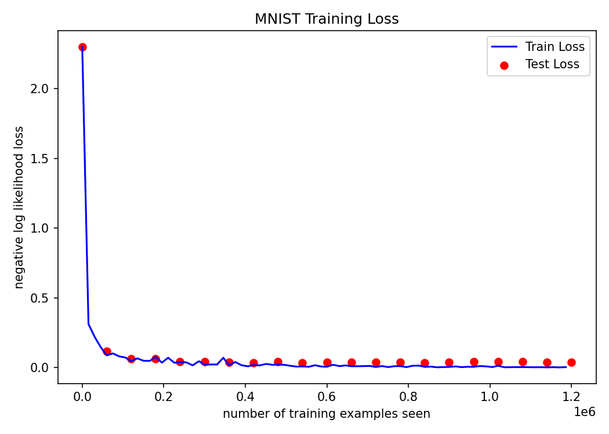
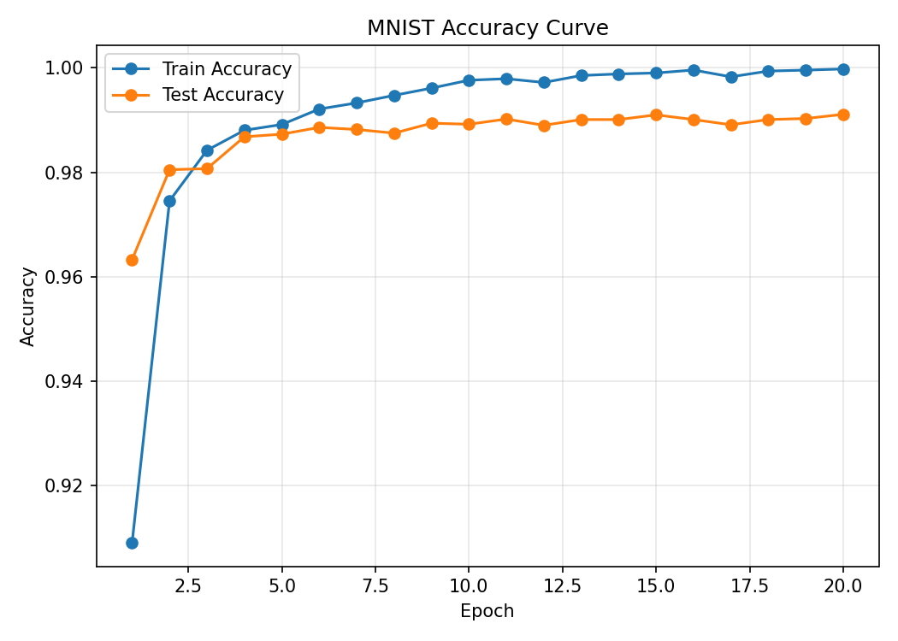

# MNIST 手写数字识别 CNN 实验报告

## 1. 实验目的

本实验使用 PyTorch 和 torchvision 在 MNIST 数据集上训练一个卷积神经网络，完成 0 到 9 的手写数字分类任务。实验目标是理解图像分类任务的基本流程，包括数据加载、预处理、模型定义、训练、测试、指标记录和结果分析。

## 2. 数据集

MNIST 数据集包含 70000 张灰度手写数字图像，其中训练集 60000 张，测试集 10000 张。每张图像大小为 1 x 28 x 28，标签为 0 到 9 中的一个数字。

本项目使用 `torchvision.datasets.MNIST` 加载数据：

- 训练集：`train=True`
- 测试集：`train=False`
- 训练集批大小：512
- 测试集批大小：512

## 3. 数据预处理

输入图像先转换为 tensor，然后使用 MNIST 常用均值和标准差进行标准化：

```python
transforms.Compose([
    transforms.ToTensor(),
    transforms.Normalize((0.1307,), (0.3081,))
])
```

标准化可以让输入分布更稳定，有助于模型训练。

## 4. 网络结构

模型定义在 `model.py` 的 `ConvNet` 中。网络包含两个卷积层和两个全连接层，最后输出 10 个类别的 log probability。

| 层 | 结构 | 输出尺寸 |
| --- | --- | --- |
| Input | MNIST 灰度图像 | 1 x 28 x 28 |
| Conv1 | `Conv2d(1, 10, kernel_size=5)` + ReLU + MaxPool2d(2, 2) | 10 x 12 x 12 |
| Conv2 | `Conv2d(10, 20, kernel_size=3)` + ReLU | 20 x 10 x 10 |
| Flatten | 展平特征 | 2000 |
| FC1 | `Linear(20 * 10 * 10, 500)` + ReLU | 500 |
| FC2 | `Linear(500, 10)` | 10 |
| Output | `log_softmax(dim=1)` | 10 类 log probability |

## 5. 训练设置

| 参数 | 值 |
| --- | --- |
| batch size | 512 |
| epochs | 20 |
| optimizer | Adam |
| loss function | `F.nll_loss` |
| random seed | 1 |
| device | CUDA 可用时使用 CUDA，否则使用 CPU |

模型最后一层使用 `F.log_softmax(out, dim=1)`，因此损失函数使用负对数似然损失 `F.nll_loss(output, target)`。

## 6. 训练结果

训练过程中记录了每个 epoch 的训练损失、训练准确率、测试损失和测试准确率。最终结果如下：

| epoch | train_loss | train_acc | test_loss | test_acc |
| --- | --- | --- | --- | --- |
| 1 | 0.3273 | 0.9091 | 0.1155 | 0.9633 |
| 2 | 0.0843 | 0.9745 | 0.0611 | 0.9805 |
| 3 | 0.0519 | 0.9842 | 0.0601 | 0.9807 |
| 4 | 0.0399 | 0.9880 | 0.0403 | 0.9868 |
| 5 | 0.0340 | 0.9891 | 0.0395 | 0.9873 |
| 6 | 0.0248 | 0.9921 | 0.0352 | 0.9886 |
| 7 | 0.0217 | 0.9933 | 0.0349 | 0.9882 |
| 8 | 0.0165 | 0.9947 | 0.0411 | 0.9875 |
| 9 | 0.0129 | 0.9961 | 0.0331 | 0.9894 |
| 10 | 0.0084 | 0.9976 | 0.0374 | 0.9892 |
| 11 | 0.0076 | 0.9979 | 0.0353 | 0.9902 |
| 12 | 0.0092 | 0.9972 | 0.0357 | 0.9890 |
| 13 | 0.0056 | 0.9985 | 0.0353 | 0.9901 |
| 14 | 0.0041 | 0.9988 | 0.0334 | 0.9901 |
| 15 | 0.0037 | 0.9990 | 0.0375 | 0.9910 |
| 16 | 0.0022 | 0.9996 | 0.0399 | 0.9901 |
| 17 | 0.0063 | 0.9983 | 0.0415 | 0.9891 |
| 18 | 0.0025 | 0.9994 | 0.0406 | 0.9901 |
| 19 | 0.0019 | 0.9996 | 0.0353 | 0.9903 |
| 20 | 0.0011 | 0.9998 | 0.0379 | 0.9911 |

最终测试准确率为 0.9911，即约 99.11%。

## 7. 图像和曲线

### 真实标签样例


### Loss 曲线



### Accuracy 曲线



### 训练后预测样例


## 8. 结果分析

从训练结果看，模型在前几个 epoch 内快速收敛。训练损失从 0.3273 降到 0.0011，训练准确率从 90.91% 提升到 99.98%。测试准确率从第 1 个 epoch 的 96.33% 提升到最终的 99.11%。

测试损失整体下降，但后期存在小幅波动。例如第 14 个 epoch 的测试损失为 0.0334，第 20 个 epoch 为 0.0379。这说明模型已经基本收敛，继续训练对测试集准确率提升有限。

训练准确率明显高于测试准确率，最终二者差距约为 0.88 个百分点。这个差距不大，但可以看出模型在训练集上拟合得更充分。由于 MNIST 数据集较简单，该模型已经能取得较高准确率。

## 9. 输出文件

| 文件 | 说明 |
| --- | --- |
| `metrics.csv` | 每个 epoch 的训练和测试指标 |
| `loss_curve.png` | 训练和测试 loss 曲线 |
| `accuracy_curve.png` | 训练和测试 accuracy 曲线 |
| `sample_ground_truth.png` | 测试样例真实标签 |
| `sample_predictions.png` | 训练后模型预测样例 |
| `mnist_cnn.pth` | 最终模型参数 |
| `optimizer.pth` | 最终优化器参数 |
| `checkpoint.pth` | 训练过程 checkpoint |

## 10. 实验总结

本实验完成了一个基础 CNN 图像分类项目的完整流程。结果表明，两层卷积加两层全连接的简单网络已经可以在 MNIST 上达到较高分类准确率。后续如果希望进一步改进，可以考虑加入 dropout、数据增强、学习率调度或更严格的验证集划分。
