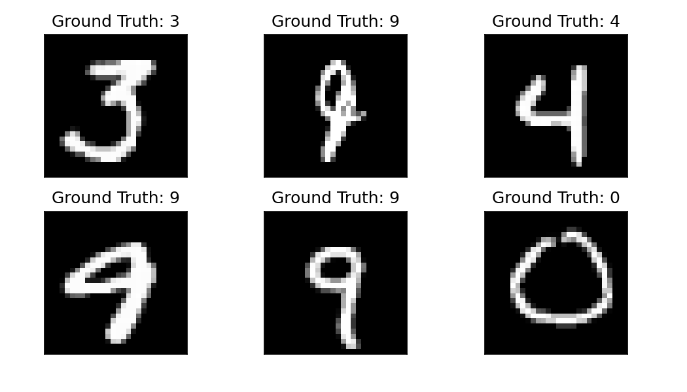

# MNIST 手写数字识别 CNN 实验报告

## 1. 实验目的

本实验参考 PyTorch Tutorial 中的 ConvNet MNIST 示例，使用 PyTorch 和 torchvision 在 MNIST 数据集上训练一个卷积神经网络，完成 0-9 手写数字十分类任务，并自动生成实验报告所需的指标、曲线图和模型文件。

## 2. 数据构成

MNIST 数据集包含 70000 张灰度手写数字图像，其中训练集 60000 张，测试集 10000 张。每张图像大小为 1 x 28 x 28，标签为 0-9 中的一个数字。

本实验使用 `torchvision.datasets.MNIST` 直接下载和加载数据：

- 训练集：`train=True`
- 测试集：`train=False`
- 训练集 DataLoader：`shuffle=True`
- 测试集 DataLoader：`shuffle=True`

## 3. 数据预处理

图像先转换为 tensor，再使用 MNIST 全局均值和标准差进行标准化：

```python
transforms.Compose([
    transforms.ToTensor(),
    transforms.Normalize((0.1307,), (0.3081,))
])
```

## 4. 网络结构

本实验采用教程中的 `ConvNet` 结构。网络包含两个卷积层和两个全连接层，最后输出 10 个类别的 log probability。

| 层次 | 结构 | 输出尺寸 |
| --- | --- | --- |
| Input | MNIST 灰度图像 | 1 x 28 x 28 |
| Conv1 | Conv2d(1, 10, kernel_size=5) + ReLU + MaxPool2d(2, 2) | 10 x 12 x 12 |
| Conv2 | Conv2d(10, 20, kernel_size=3) + ReLU | 20 x 10 x 10 |
| Flatten | view(batch_size, -1) | 2000 |
| FC1 | Linear(20 * 10 * 10, 500) + ReLU | 500 |
| FC2 | Linear(500, 10) | 10 |
| Output | log_softmax(dim=1) | 10 类 log probability |

## 5. 训练方式与参数

| 参数 | 取值 |
| --- | --- |
| batch_size | 512 |
| epochs | 20 |
| optimizer | Adam |
| loss function | NLLLoss |
| log_interval | 30 |
| random_seed | 1 |
| device | cuda |

训练时每个 epoch 执行一次完整训练集迭代，然后在测试集上评估平均损失和准确率。训练过程会保存模型参数、优化器参数和 checkpoint。

## 6. 损失函数

模型最后一层使用：

```python
F.log_softmax(out, dim=1)
```

因此损失函数使用负对数似然损失：

```python
F.nll_loss(output, target)
```

测试阶段使用 `torch.no_grad()`，避免保存计算图，从而降低内存开销。

## 7. 初始测试结果

训练前，随机初始化模型在测试集上的表现为：

- initial test loss: 2.2995
- initial test accuracy: 0.1166

## 8. 训练结果

| epoch | train_loss | train_acc | test_loss | test_acc |
| --- | --- | --- | --- | --- |
| 1 | 0.3273 | 0.9091 | 0.1155 | 0.9633 |
| 2 | 0.0843 | 0.9745 | 0.0611 | 0.9805 |
| 3 | 0.0519 | 0.9842 | 0.0601 | 0.9807 |
| 4 | 0.0399 | 0.9880 | 0.0403 | 0.9868 |
| 5 | 0.0340 | 0.9891 | 0.0395 | 0.9873 |
| 6 | 0.0248 | 0.9921 | 0.0352 | 0.9886 |
| 7 | 0.0217 | 0.9933 | 0.0349 | 0.9882 |
| 8 | 0.0165 | 0.9947 | 0.0411 | 0.9875 |
| 9 | 0.0129 | 0.9961 | 0.0331 | 0.9894 |
| 10 | 0.0084 | 0.9976 | 0.0374 | 0.9892 |
| 11 | 0.0076 | 0.9979 | 0.0353 | 0.9902 |
| 12 | 0.0092 | 0.9972 | 0.0357 | 0.9890 |
| 13 | 0.0056 | 0.9985 | 0.0353 | 0.9901 |
| 14 | 0.0041 | 0.9988 | 0.0334 | 0.9901 |
| 15 | 0.0037 | 0.9990 | 0.0375 | 0.9910 |
| 16 | 0.0022 | 0.9996 | 0.0399 | 0.9901 |
| 17 | 0.0063 | 0.9983 | 0.0415 | 0.9891 |
| 18 | 0.0025 | 0.9994 | 0.0406 | 0.9901 |
| 19 | 0.0019 | 0.9996 | 0.0353 | 0.9903 |
| 20 | 0.0011 | 0.9998 | 0.0379 | 0.9911 |

## 9. 曲线图与样例图

### 样例真实标签



### Loss 变化曲线


### Accuracy 变化曲线


### 训练后预测样例


## 10. 结果分析

- Loss：测试集 loss 整体下降。
- Accuracy：测试集 accuracy 整体上升。
- 最终测试准确率：0.9911。
- 过拟合迹象：训练准确率与测试准确率差距较小，未观察到明显过拟合迹象。

## 11. 输出文件

- `metrics.csv`：每个 epoch 的 train loss、train accuracy、test loss、test accuracy。
- `loss_curve.png`：训练和测试 loss 曲线。
- `accuracy_curve.png`：训练和测试 accuracy 曲线。
- `sample_ground_truth.png`：测试样例真实标签。
- `sample_predictions.png`：训练后预测样例。
- `mnist_cnn.pth`：最终模型参数。
- `optimizer.pth`：最终优化器参数。
- `checkpoint.pth`：训练过程 checkpoint。

## 12. 实验总结

本实验完整覆盖了一个图像分类项目的基本流程：加载数据集、预处理、定义 CNN、训练模型、测试模型、保存指标和图表。实验结果表明，简单的两层卷积网络已经能在 MNIST 上取得较高准确率。由于 MNIST 数据集较简单，本实验更适合作为 PyTorch 图像分类流程模板，而不是复杂真实场景模型性能的代表。
